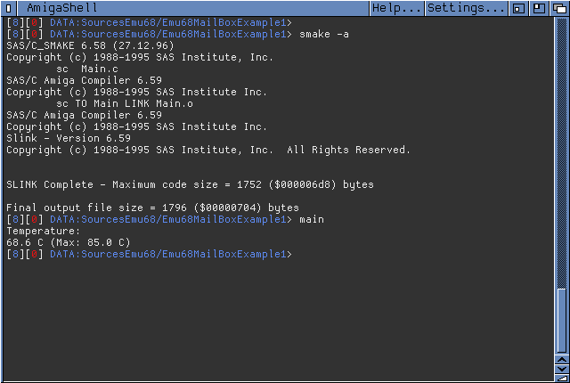

# Emu68MailBoxExample1

This is a `C89` example that shows how to use the new Emu68 `mailbox.resource`

## Requirements:

### 1. Emu68 1.1+ from
* https://github.com/michalsc/Emu68/releases
* https://github.com/michalsc/Emu68/releases/download/v1.1.0-alpha.1/Emu68-pistorm.zip

### 2. Emu68-tools for Emu 68 1.1+ from
* https://github.com/michalsc/Emu68-tools/releases
* https://github.com/michalsc/Emu68-tools/releases/download/v1.1/Emu68-tools.zip

### 3. Copy the Emu68-tools headers from the archive to your amiga SDK headers
* Emu68-tools\Developer\include

### 4. Inludes this files in your program

```c
#include <resources/mailbox.h>
#include <proto/mailbox.h>
```

### 5. Use MB_RawCommand() to make a mailbox request

```c
ULONG cmd[8];
cmd[0] = 8 * 4;  // Request size in bytes
cmd[1] = 0;      // Request return code
cmd[2] = tag;    // Request tag identifier
cmd[3] = 2 * 4;  // Response size in bytes
cmd[4] = 0;      // Response code
cmd[5] = arg;    // Response[0]
cmd[6] = 0;      // Response[1]
cmd[7] = 0;      // End of request
MB_RawCommand(cmd);
```

### Preview

